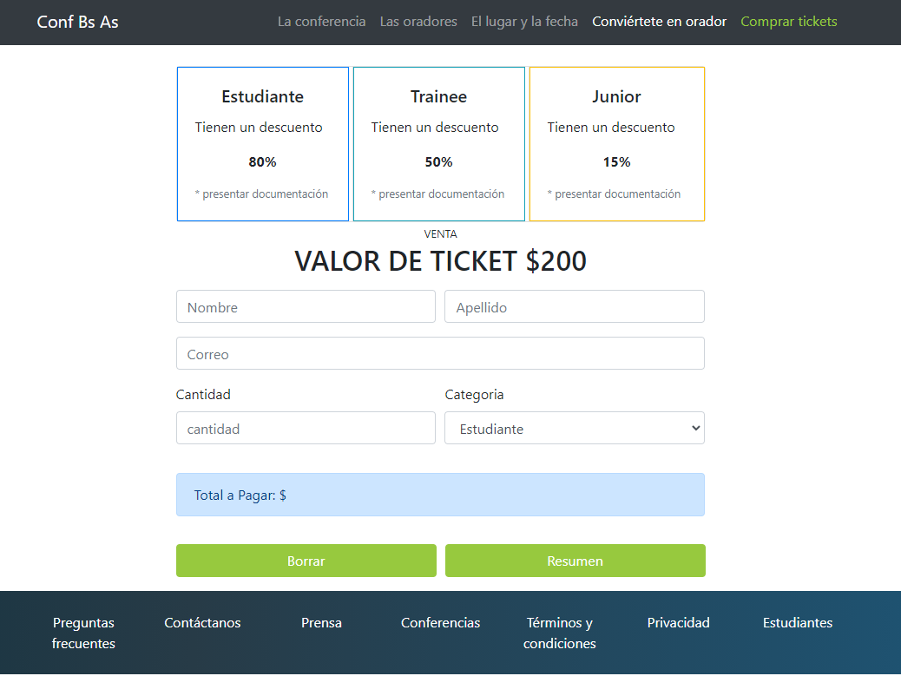

# codoAcodoBootstrap01
<h1>Desafio Bootstrap para Codo A Codo</h1>

Primer trabajo practico integrador de Bootstrap para el curso de Codo A Codo de la Ciudad Autonoma de Buenos Aires.

<a href="https://hernanruscica.github.io/codoAcodoBootstrap01/" target="_blank" rel="noreferrer noopener">Demo online</a>

Ejemplo pasado para escritorio, version mobile por cuenta propia. 
<b>Cesar Hernan Ruscica</b> DNI: 28470361 <b>Comision: 22578</b> "Curso codo a codo"<b> Segundo cuatrimestre 2022</b>

<h2>Enunciado de la segunda parte</h2>

Deberán replicar la siguiente sección (es una sección que se debe agregar al integrador front-End) al presionar en el enlace “tickets”.

Deberá contener la funcionalidad en Javascript, al momento de presionar el botón “Resumen”, deberá mostrar en la sección “Total a Pagar: $”, el monto correspondiente a la cantidad de tickets a comprar con el descuento correspondiente dependiendo la categoría seleccionada, existen 3 categorías, Estudiante, Trainee, Junior

